# 微信聊天记录导出和年度报告制作小软件

(软件下载地址在文末！)

本软件是由个人凭借兴趣开发，用于对手机微信聊天记录导出和统计分析。其主要功能为

每年年终相信大家的朋友圈里可能都会出现很多网易云音乐、QQ音乐等软件的听歌年度报告，B站的up主也会收到一个年终总结，在这个大数据的时代，通过自动化的程序可视化的展现自己的年终总结未尝不是一件有趣的事情。然而，我们最常用的聊天软件，也是我们日常生活中产生信息量最大的软件——微信，却不能生成任何年度报告。

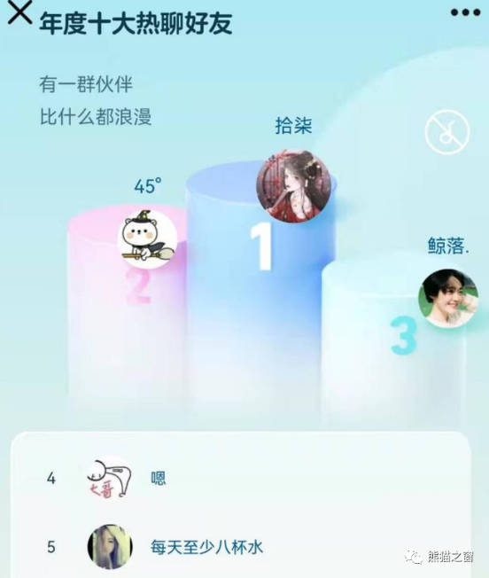

图 1 QQ 年度报告

QQ从2021年开始就可以在年底通过搜索社交形象找到生成年度报告的入口了（如图 1）。但微信很多年了却从不提供这样的功能。更糟糕的是，微信甚至不让我们用户导出属于自己的聊天记录！！！这有点令人匪夷所思，因为微信与QQ最大的不同点就是微信服务器不留存用户任何的聊天记录，聊天内容只存储在用户的手机、电脑等终端设备上。按理说既然所有聊天记录都在用户设备上，只要微信中简单增加一个API就能将其转换为excel表格类型供用户分析，但这么多年过去了，腾讯显然没有这样的计划，个人猜测或许是担心其他应用非法获取用户聊天记录造成隐私泄露的问题。

既然微信所有的聊天记录都是存在本地的，那我们为什么不能直接拷贝出来呢？这里又涉及到另一个问题，那就是这个储存聊天记录的数据库是被微信加密了的，而且还放在一个没有root手机就不能访问的目录里！最重要的是加密的密码并不是我们自己微信的密码。显然想要获取自己的信息也不是件容易的事情，希望以后微信能解决这个问题，让我们每个人都可以合法便捷的导出自己的聊天记录。

也许你会觉得直接用微信本身的查找功能就能方便，为何还需要导出聊天记录呢？这里可以借用苏轼的《题西林壁》来打个比方，不能导出的聊天数据让人“不识庐山真面目，只缘身在此山中”，而导出成excel后的聊天记录就如同给了我们一个无人机俯瞰群山的视角，能帮助我们更清晰的了解每个朋友和自己聊天的特点，在朋友圈里也可以引起一波热烈的讨论，即能增长见识，又能收货乐趣。最重要的是，我们不止可以制作所有好友的统计报告，还能针对你在乎的好友单独制作个人的微信年度报告，如果是情侣的话也许还有别的统计指标。

## 一. 效果图展示

下面简要介绍一下pdX_Wechat_Stats软件能做出的统计图：

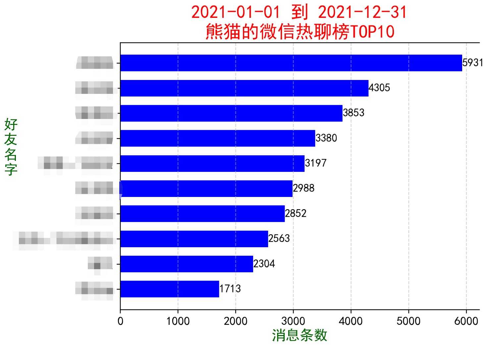

对于所有好友的统计，聊天消息数量排行榜自然少不了，从这里也可以看出你们的关系，以及每年排行榜的变化。当然，也可看看TOP10里异性朋友有多少，聊天消息数量差异有多少。

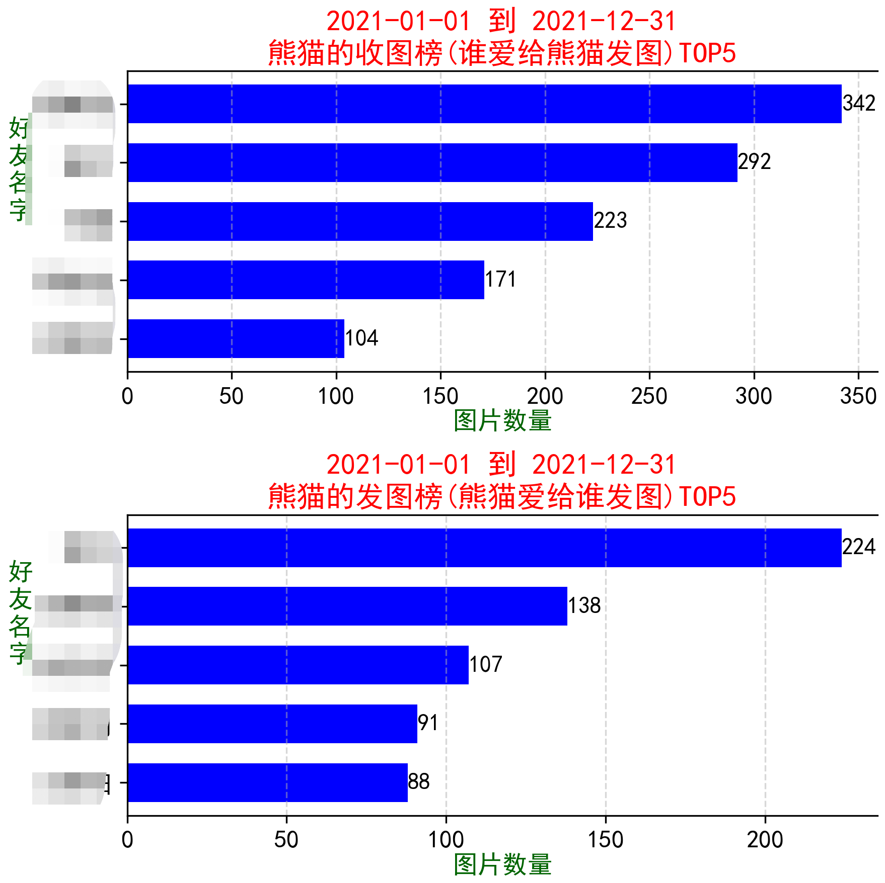

收图和发图都有一个排行榜，图片榜最能体现出哪位是好友中的发图狂魔。

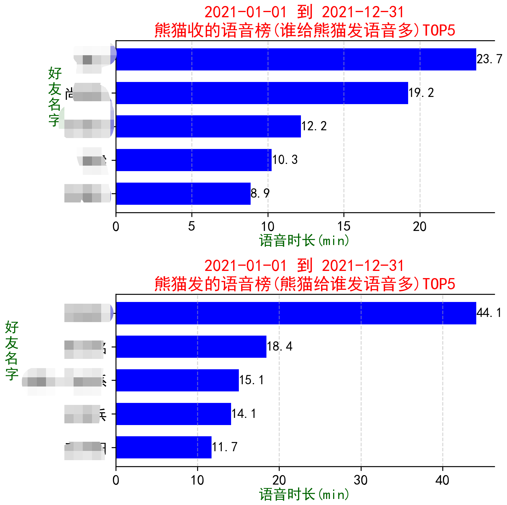

语音榜最大的特点在于统计的是语音时长，而不是语音消息的条数，这更加准确的反映出了哪位仁兄是语音狂人。

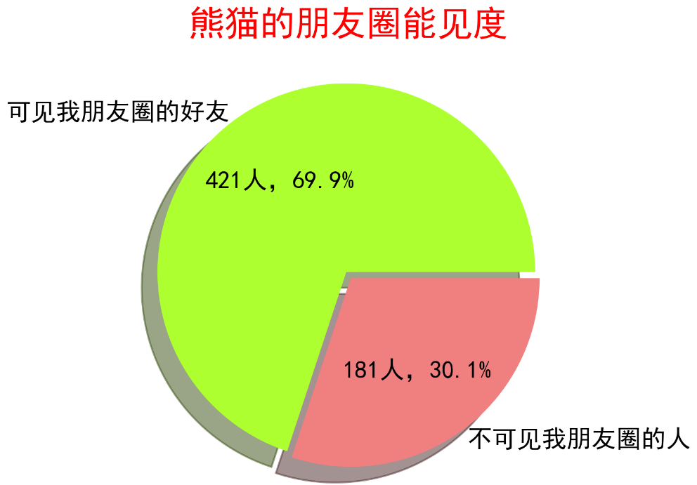

也许每个人都会有一些仅聊天以及不对其开放朋友圈的好友，但你也许并不知道他们有多少，这个能见度饼图可以从某种程度上让你了解到自己内心的开放程度。

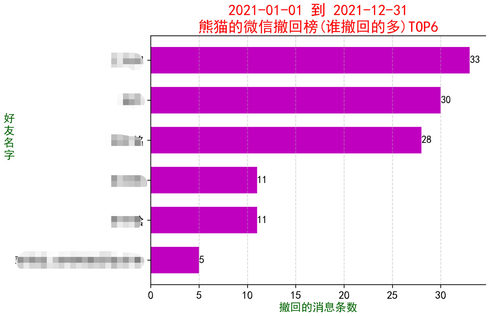

撤回榜这里你能看出哪位好友特别喜欢撤回消息，也许会勾起你的一些回忆。

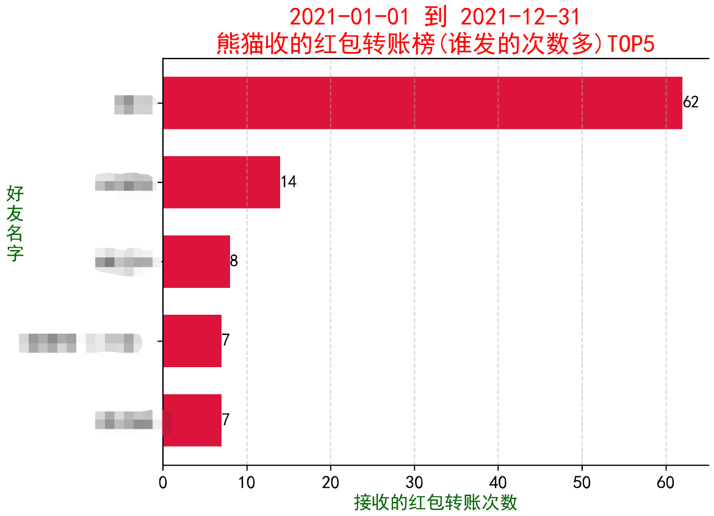

红包转账榜能告诉你哪位好友对你是真爱，或者是资金往来比较密切。

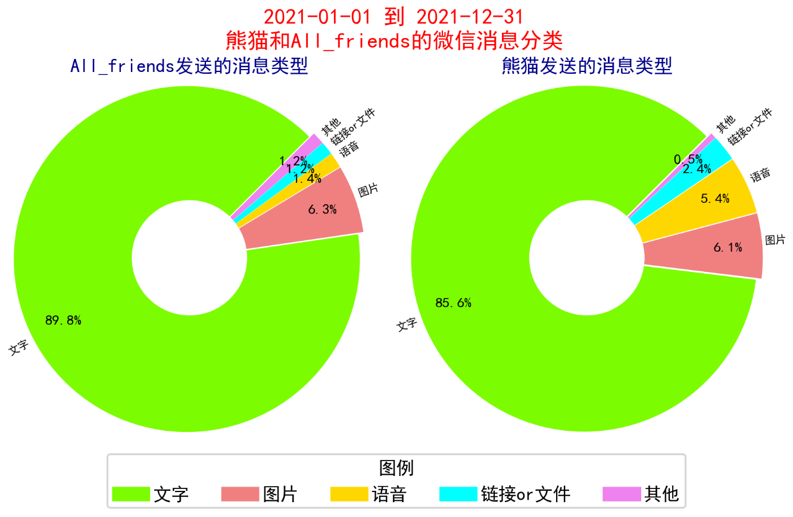

自己发送和对方发送的消息类型环形图则能够很清晰的体现出每个人的聊天特点。文字一般都居多，但个别语音或者图片小王子的消息类型可能与我大相径庭。特别需要说明一下：图上的某些文字故意被设置的很小，为的是让大家重点看图例。

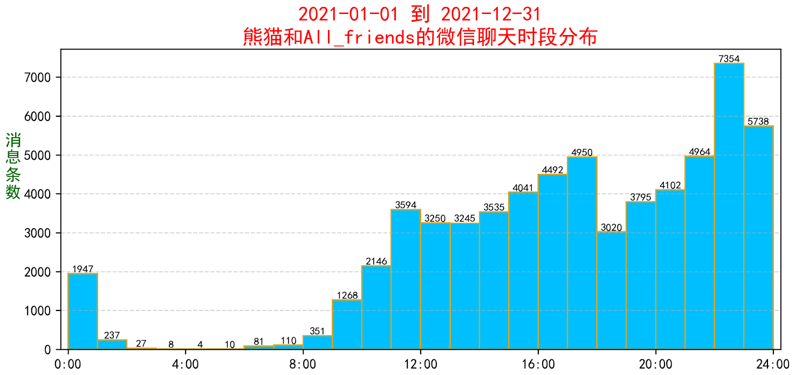

聊天时段能反映出你的作息规律，也许会隐藏着某些你未曾发现的特点。

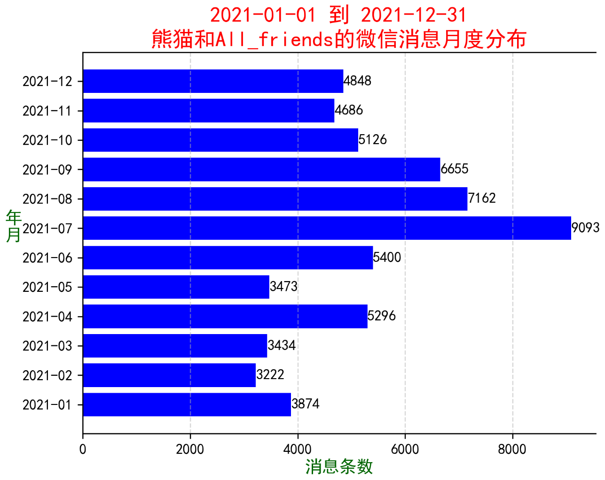

消息条数月度分布则能够显示出一年中哪些月份你在微信上最忙。我这里7月和8月的高峰是被人进行消息轰炸后的结果，不知道大家每月的消息数量是不是在我的平均值之上？

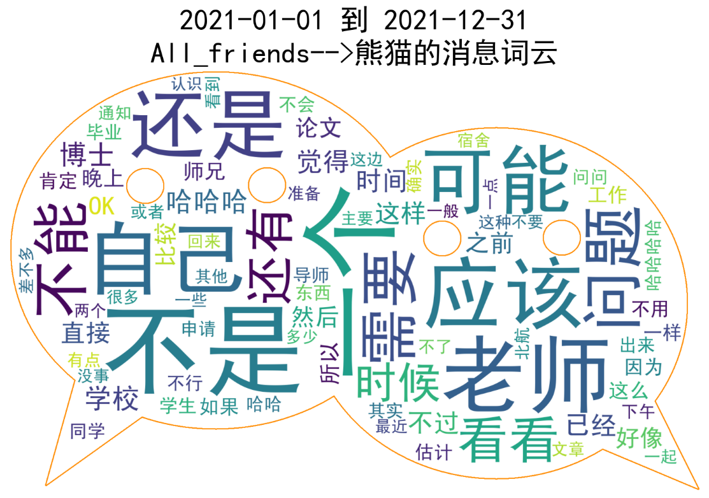

图 对方发送的消息词云

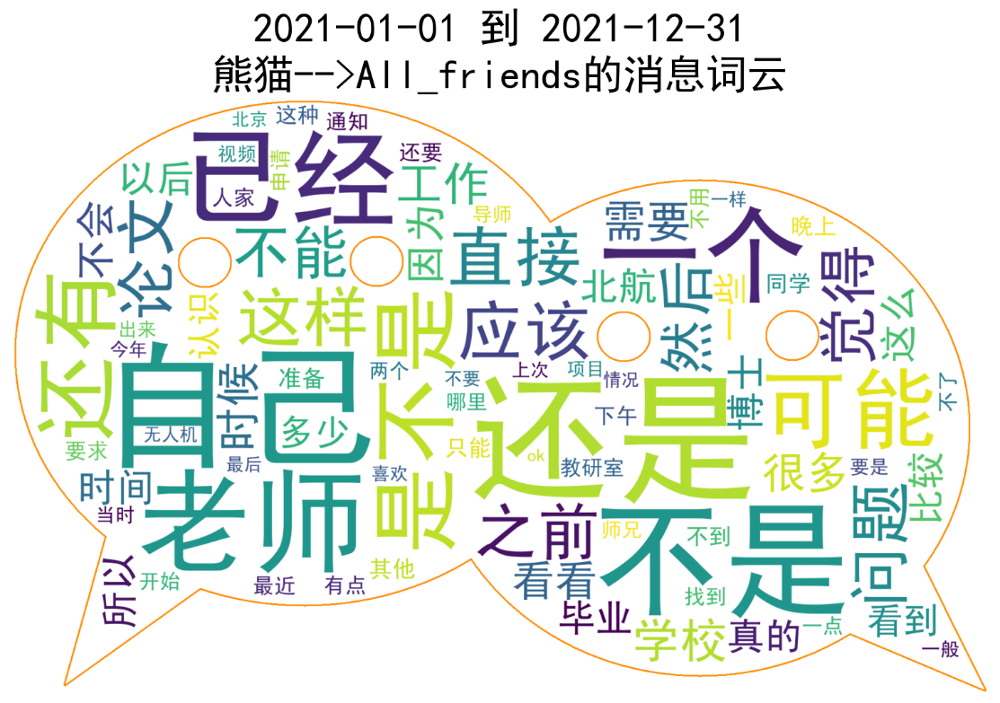

图 自己发送的消息词云

词云自然也是一个很有趣的关键词提取环节，可视化效果非常好，而且本软件还允许用户自定义分词词库，停用词词库以及更改词云外形图片，我这里默认给大家用的是微信的图标作为外形。

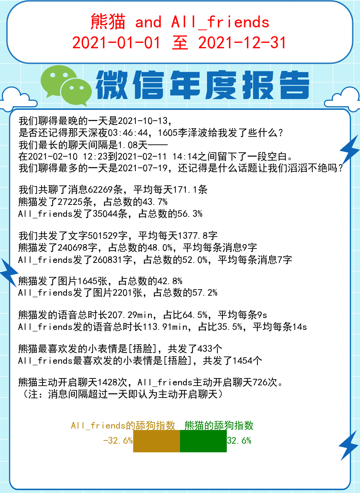

最后一幅文字海报也是经过我精心设计的成果。除了最晚聊天时间，最长聊天间隔，最多聊天日期，还分别针对自己和好友做了对比统计，尤其是在最后引入了舔狗指数，根据主动开启聊天的次数计算，正数越大舔狗特性越显著，负数越小被舔的特性越显著。

** 除了All_friends，还可以任意选择单个好友制作同样形式的但更为私密的年度报告，是不是也很有趣？针对个人的年度报告里的舔狗指数是不是也会更加扎心一点。**

此外，本软件不止能生成以上提到的各种图表，还能自动把所有的图按顺序整理进一个word文档，方便你发送给别人或者自己长期储存，word文档的名字已好友名字+report命名。

更为重要的是，本软件还能导出你选择的好友的聊天记录成excel格式的表格，命名为好友名字+_MsgTable.xlsx，表中包含如下图所示的字段：

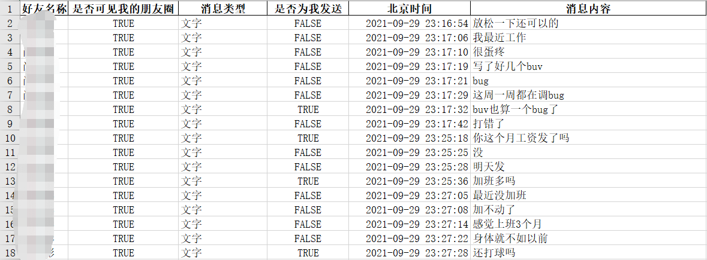

采用excel的数透表功能，你可以很轻松的制作出一些本软件没有提供的个性化图表，比如分时段统计消息类型，或者其他我想不到的方案。可以说，导出这个excel表格相当于给了你无限的分析自由度，你可以基于此制作更好看的图表，而不用受到python第三方库拉跨能力的限制。

## 二. 下载pdX_Wechat_Stats小软件

相信大家看了前面介绍的各种功能心中是否也迫不及待地想制作一份自己微信的年度报告呢？下面我就来简要介绍一下如何使用我写的这个软件吧。本软件全部由python语言编程，主要调用了sqlite3，Tkinter, pandas, numpy, pillow, matplotlib, re, jieba以及wordcloud等第三方库，所有程序都已经打包成了一个exe文件。软件下载地址在最下方。

我为本软件设计了简单的gui界面，满足大家日常的操作便捷性，至于美观程度的话大可不必吐槽，因为我没时间顾及，毕竟作为飞行器设计专业的博士，我的主业是给飞机写代码，不是做GUI。

特别提醒，本软件已申请著作权，请勿仿冒！

百度网盘链接：https://pan.baidu.com/s/1FFs5sXYl62Z6MHNtfQsS4g?pwd=6666

提取码：6666
