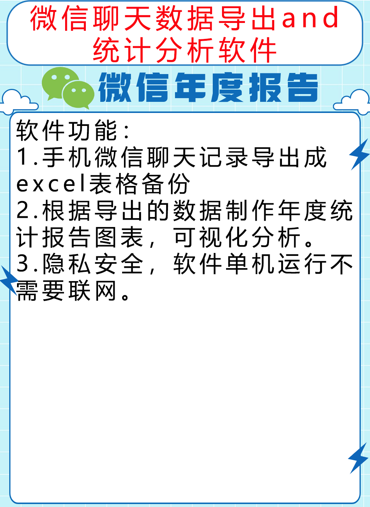
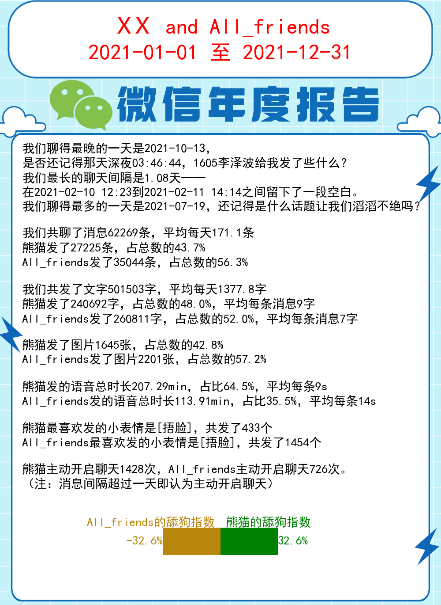
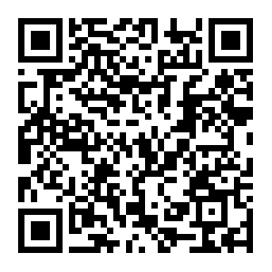

# 微信聊天数据导出和年度报告

#### 简介
个人用python开发的微信聊天数据导出和年度报告制作小软件，欢迎大家使用体验和提建议。

#### 主要功能

pdx_Wechat_Stats软件能够实现的功能可以参考微信公众号的另一篇文章（地址复制到浏览器中访问）：  
https://mp.weixin.qq.com/s/YFWW7frvkqmLIiNX3PNlpA
更多详细介绍请微信扫码关注我的公众号查看。  

#### 使用说明
pdx_Wechat_Stats软件使用方法请参考我微信公众号的文章（地址复制到浏览器中访问）：
https://mp.weixin.qq.com/s/4UjSJ-ZRZU0CKZHKKkOxDg  
或微信搜索“熊猫之星”公众号，关注后点击菜单查看

#### tb链接
PC端：  
https://item.taobao.com/item.htm?spm=a1z10.1-c.w4004-24240613654.3.3e5978fe2RGpBp&id=668925552938  
移动端：  

#### 特技

可以统计你的微信热聊榜top10
