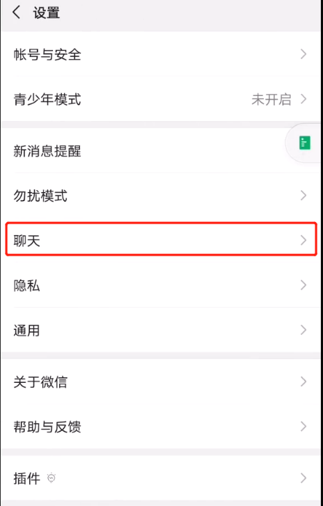
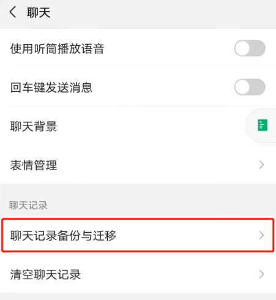
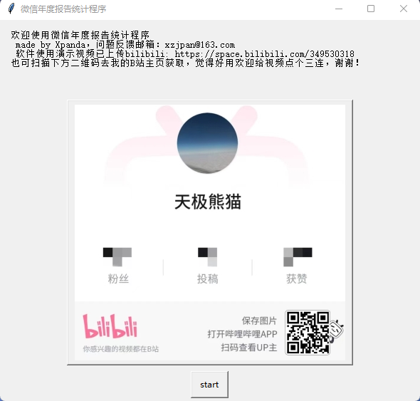

# 微信聊天记录导出及年度报告软件使用方法

（软件下载地址在文末）
要想使用pdX_Wechat_Stats软件，首先要获取自己微信聊天记录的数据库。类比计算流体力学，我把导出微信聊天数据这个过程称为前处理，实现这个功能的商用软件有不少，但价格普遍高得离谱，而且一般具备前处理功能，后续的分析图表也不能生成，不得不说是非常昂贵了。

那么如何避免落入这样低性价比的坑呢？当然是自己动手，丰衣足食了。其实我也可以在程序中帮助大家实现这个前处理的功能，但考虑到这样做有法律风险，可能会被别有用心的人诬告为非法获取用户信息，所以聊天记录导出这个前处理过程我就不在程序中写了，这里教大家用最简单的方法手动导出微信聊天数据库EnMicroMsg.db文件，之后解密数据库和分析制图的工作交给我写的pdX_Wechat_Stats软件就ok了！

## 一.前处理

不论你的手机是Android还是iOS的操作系统，想要获取root权限（苹果称为越狱）在现在各大品牌机上都变得不太可能（亲测华为和小米的旗舰机都不行），然而要想拿到EnMicroMsg.db数据库文件，就必须访问root权限才能开放的根目录。如果你手边正好有一台能够root的Android设备，比如老旧手机或者杂牌低配机，那你可以尝试把微信的聊天记录同步到那台设备上再访问。如果没有能够root的手机，我们就需要借助电脑上的安卓模拟器实现root的手机功能了。

注意这里有个很重要的条件：安装安卓模拟器的电脑必须带有摄像头，最好是你的笔记本。实在没有的话，也可以在手机上安装虚拟机，只要能够获取root权限即可！

这里以win10电脑上的Android模拟器为例，简要说明一下操作步骤：

1. 首先随便下载一个Android模拟器（比如雷电，夜神，逍遥等）
2. 然后在模拟器的设置中打开root权限（如下图是雷电模拟器的设置截图）

图 1 模拟器设置root权限

3. 在模拟器上安装微信，模拟器分辨率设置为手机形式的窄长型，注意不必着急登录，否则会把你正常手机上的微信踢下线。

图 2 模拟器安装微信

4. 进入你平时正常使用的手机上的微信，点击设置聊天聊天记录备份与迁移迁移迁移到手机/平板微信

图 3 导出设置

图 4 导出设置

图 5 导出设置

图 6 导出设置

图 7 导出设置

5. 选择聊天记录的时间和内容。内容强烈建议选择”不含图片/视频/文件”，否则迁移过程可能会非常慢。时间以你想统计的年月日跨度为准，可以导入几年或者几个月的，本程序都设计了智能识别的处理机制，但跨度超过2年以上的聊天记录可能数据量非常大，迁移过程可能会很慢，如果可能尽量选取跨度1年左右的聊天记录。另外必须强调的一点是最好不要迁移群聊的记录，尽量选取你认为有必要统计的好友的私聊记录，不要点击全选，否则软件可能会因为数据量过大而崩溃。本软件只统计私聊的内容，涉及群聊的会在程序内部自动删除，因此如果不小心选到了群聊的也不必担心软件出错，只要不是无脑全选各种聊天记录，本软件都能有效处理。

6. 选择完成后点击迁移聊天记录，会出现如下的二维码，此时在电脑的模拟器上登录微信，用摄像头扫描该二维码即可开始同步。

7. 同步完成后，在安卓模拟器的根目录/data/data/com.tencent.mm/MicroMsg/(一个32位字符串命名的文件夹中)中找到EnMicroMsg.db文件。这里的（32位字符串命名的文件夹）如果你只在模拟器上登陆过一个微信的话就只有一个，如果有两个这样命名的文件夹的话（如下图），那就每个都打开看看哪个文件夹中能找到EnMicroMsg.db。找到后将该db文件拷贝到电脑上。关于如何从安卓模拟器中复制文件到电脑文件夹中，每个模拟器操作方法各不相同，请自行百度解决。

8. 获取手机IMEI码和你的微信uin值。具体操作方法可以自行百度，每种安卓模拟器都会有显示IMEI值的地方，至于微信uin，也就是你真实的微信号，需要在安卓模拟器的根目录/data/data/com.tencent.mm/shared_prefs文件夹下找到auth_info_key_prefs.xml文件拷贝到电脑中并用记事本打开，找到如下auth_uin文字，其中value后面跟着的就是你的uin码了，我的是8位，每个人uin码的位数可能不一样。至此，前处理任务就算大功告成了。

## 二 后处理

1. 根据下面或文末的连接下载pdX_wechat_stats文件夹（或者压缩包），并将其复制（或解压）到一个英文目录下，进入解压后的pdX_wechat_stats文件夹内，找到Wechat_StatsV1.exe文件，退出各种杀毒软件后再双击打开（毕竟自己开发的小软件没给杀软交过路费），本软件没有后门，可以断网运行，不会窃取你的聊天记录上传。

百度网盘链接：<https://pan.baidu.com/s/1FFs5sXYl62Z6MHNtfQsS4g?pwd=6666>

提取码：6666

2. 双击打开后需要耐心等待5-10秒左右，因为我在打包过程中设置了加密算法防止别有用心的人破解，所以需要自解密一会。

软件打开后首先会弹出下图提示窗：

请认真阅读以后显示的每一个提示窗的文字！！！也欢迎大家给我b站的视频一个三连支持下。

3. 之后如果是第一次运行会提示注册，将显示的机器码，请复制并记录下该机器码，仔细阅读pdX_wechat_stats文件夹中的ReadMe.txt文档，找到注册码的获取方法。

4. 该注册码成功解锁后即可永久使用，不限微信号，不限时间，重装系统也不会失效！

5. 之后如果是第一次使用，需要将前处理步骤中获取的EnMicroMsg.db这个数据库文件拷贝到Wechat_StatsV1.exe所在的文件夹“pdX_wechat_stats”（以下简称程序文件夹）中，特别要注意，这个文件夹中的其他文件千万不要删或者随意重命名，否则程序很可能崩溃。
6. 建议在打开软件前就把数据库文件拷贝到程序文件夹，如果拷贝正常那么下一步程序会显示如下界面，请你输入前处理步骤中获取的IMEI码和你的微信uin。

7. 之后软件会自动帮你解密EnMicroMsg.db数据库文件，解密过程中会弹出cmd的黑色窗口，不用理会但千万不要手动关闭，如果解密成功，会弹出如下所示的提示，之后再次运行软件想要打开同一个数据库的话就不用二次解密了，软件会直接跳过解密步骤进入下一步，非常的方便。

8. 如果想要分析另一个微信号或者新一段时间的数据库，在下图的提示中选择“解密新的”，之后按照弹窗提示内容来做就行了，再次提醒大家注意认真阅读每个弹窗的内容，不要着急点关闭，按照要求来操作这里就不再赘述了。

9. 解密成功后程序开始进入分析步骤，首先会让你选择你想统计的好友，这里选择All_friends的话最后生成的图表会比选择任何个人要多出6张排行榜，其他区别以及注意事项请仔细阅读窗口的提示文字！

10. 以上好友列表的顺序是按照姓名拼音的顺序升序排列的，和ASCII码值的顺序类似，数字排在字母前面。如果你的好友太多，在列表中不好找到的话，可以点击Cancel转入手动输入界面，本程序也设计了相应的GUI接口，此处不再放图赘述。
11. 选择完待分析的好友后，程序会让你输入你想要的命名，这个命名会体现在每一张图表的标题上，建议给你和待分析的好友都起一个短一点的名字（一般人名不要超过4个字），否则图表可能会因为标题过长而变形。

12. 接着程序会在程序目录中（即pdX_wechat_stats文件夹）生成一个好友名字+_statistic命名的文件夹，并在其中导出你选择的好友的聊天记录为excel表格（名字为XXX_MsgTable.xlsx），表格内容在前述的效果展示中已经描述过了。之后所有关于该好友的统计图表和word版报告都会导出到该文件夹中。

13. 在word版报告的制作过程中，程序会提示你词云选项

14. 请输入你想自定义的分词词典，该词典输入一次后会自动保存，再次运行程序会自动加载上次输入的词汇。如果不理解这个词典什么意思，建议百度jieba自定义词库。

15. 请输入你不想在词云中显示的词汇，该词典输入一次后同样会自动保存，再次运行程序会自动加载上次输入的词汇。如果不理解这个词典什么意思，建议百度词云停用词。

16. 稍等片刻，生成的两幅词云图会自动弹出，你可以根据生成的效果选择是否满意，如果选择不满意想要修改词典，程序会返回第14步，你可以无限次修改，直到点击满意继续下一步为止。

17. 考虑到舔狗指数对于和我一样的广大单身狗朋友们伤害性过高，本程序贴心的设计了可选展示，你可以在下图所示的选择框中自由选择展示与不展示舔狗指数在文字海报上。

18. word报告输出成功后会展示捐赠界面，还请各位帅气的小哥哥小姐姐大方一点，给我这样独立开发软件的爱好者一点坚持研究的激励。

19. 最后如果你的电脑上安装了word2010以上的版本，程序会自动打开导出的word版年度报告，这个word也可以在第13步中提到的名字文件夹中找到并手动打开，此外该文件夹中还保存有分辨率足够满足论文发表要求的高清图（300dpi），有科研需要的朋友直接看英文名就懂了，此处就不科普了。

软件下载百度网盘链接：<https://pan.baidu.com/s/1FFs5sXYl62Z6MHNtfQsS4g?pwd=6666>

提取码：6666
